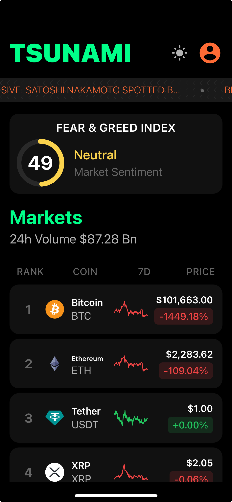

# Tsunami - Cryptocurrency Tracker

Tsunami is a mobile application for tracking cryptocurrency prices, managing a watchlist, and staying up-to-date with the latest market news.

### June 2025



### May 2023


## ✨ Features

*   **Real-time Price Tracking:** Monitor cryptocurrency prices in real-time.
*   **Watchlist:** Keep a close eye on your favorite cryptocurrencies.
*   **News Feed:** Get the latest news from the crypto market.
*   **Dark Mode:** A sleek dark mode for a better viewing experience.

## 🚀 Getting Started

Follow these instructions to get the project up and running on your local machine for development and testing purposes.

### Prerequisites

*   Node.js and npm: [https://nodejs.org/](https://nodejs.org/)
*   Expo CLI: `npm install -g expo-cli`
*   Expo Go app on your [iOS](https://apps.apple.com/us/app/expo-go/id982107779) or [Android](https://play.google.com/store/apps/details?id=host.exp.exponent) device.

### Installation

1.  Clone the repository:

    ```bash
    git clone https://github.com/your-username/tsunami-rn.git
    ```

2.  Navigate to the project directory:

    ```bash
    cd tsunami-rn
    ```

3.  Install the dependencies:

    ```bash
    npm install
    ```

### Running the App

1.  Start the Expo development server:

    ```bash
    npm start
    ```

2.  Scan the QR code with the Expo Go app on your phone to preview the app.